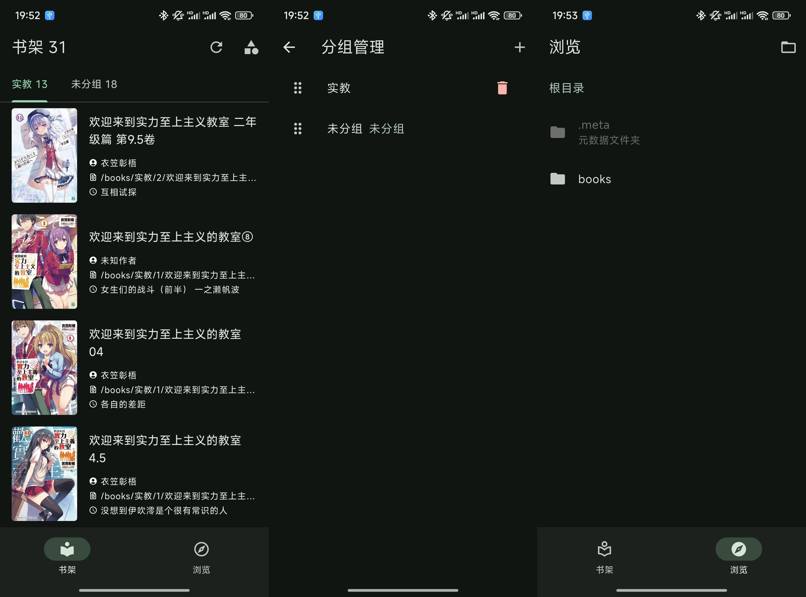

废弃，转移到 

Flutter 编写的 Epub 阅读器，支持基本的阅读和书架管理功能。

理论上可以支持 Android 和 iOS，但是我没有苹果设备，所以只能编译 Android 版本。

## 截图

主页：

阅读页：

## TODO

- [x] 设计一个 logo
- [x] 完善初始化页面
- [x] 书籍的描述放到一个单独的文件内，不然太大了
- [x] 更改 meta 文件夹的结构（book_infos.json、每个书籍解析对应其相对路径的 md5 文件夹）
- [x] 完善书架中书籍 tile，尤其是图片显示
- [x] 完善导入书籍的对话框
- [x] 阅读页面的动画、阴影等
- [x] 分组管理单独放到一个 json 文件中
- [x] 书籍详情页面、分组管理
- [x] 完善阅读页面的动画、阴影等
- [x] 记录阅读进度、按照最后阅读时间排序
- [x] 书架的下拉刷新
- [x] 从主页面到阅读页面的加载过程变得更加平滑流畅一点
- [x] 改成注入 javascript 的方案
- [ ] 修复小窗 overflow 问题
- [x] 尽量将一些函数放到后台线程执行
- [ ] 将臃肿的耦合度高的代码优化一下
- [ ] 阅读页关闭面板时隐藏标题栏
- [ ] 阅读页左上角当前标题，右下角进度
- [ ] 阅读页进度条
- [x] 字号调整
- [x] 背景调整
- [ ] 亮度调整
- [ ] 段落间距调整
- [ ] 音量键翻页
- [ ] 兼容多看：
- 图片：duokan-image-gallery、duokan-image-single
- 弹出式注释：duokan-footnote、duokan-footnote-content、duokan-footnote-item
- properties：duokan-page-fullscreen、duokan-page-fitwindow、duokan-page-fullscreen-spread-left
- [ ] 书签功能
- [ ] 设置界面

## 参考

https://github.com/Mantano/iridium

https://github.com/ScerIO/epubx.dart

https://github.com/FlafyDev/epub_reader

https://github.com/Acclorite/book-story

多看阅读、微信阅读

Lithium、Reasily、ReadEra
